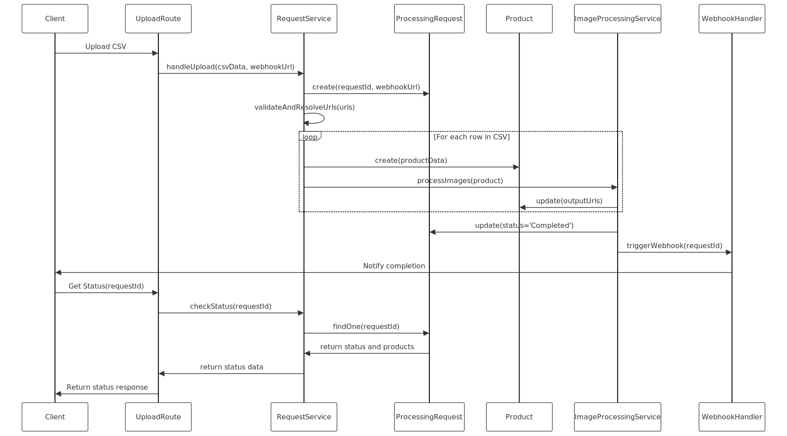

# CSV Processor Technical Design Document
## Table of Contents

1. [Project Overview](#1-project-overview)
2. [System Architecture](#2-system-architecture)
3. [Component Breakdown](#3-component-breakdown)
4. [Data Flow](#4-data-flow)
5. [Endpoints](#5-endpoints)
6. [Database Schema](#6-database-schema)
7. [Third-party Integrations](#7-third-party-integrations)
8. [Security Considerations](#8-security-considerations)
9. [Scalability and Performance Considerations](#9-scalability-and-performance-considerations)
10. [Deployment Architecture](#10-deployment-architecture)
11. [Error Handling Strategy](#11-error-handling-strategy)
12. [Logging Strategy](#12-logging-strategy)
13. [Image Processing Strategy](#13-image-processing-strategy)
14. [Request Processing Strategy](#14-request-processing-strategy)

## 1. Project Overview

This Node.js project is a web service that handles CSV file uploads containing product information and image URLs. It processes these files asynchronously, performs image processing tasks, and provides status updates via webhooks. The system is designed to manage long-running tasks efficiently by using asynchronous processing and providing immediate feedback to clients. It includes robust error handling, data modeling, logging functionalities, and image processing capabilities.

## 2. System Architecture

The project follows a modular architecture, separating concerns into different components:

- Upload handling
- Status checking
- Webhook triggering
- Database interactions
- Configuration management
- Error handling
- Logging
- Data modeling and relationships
- Image processing
- Request processing

### System Architecture

### Sequence Diagram

### State Diagram

### Class Diagram 

## 3. Component Breakdown

### 3.1 upload.component.js

**Role:** Handles the CSV file upload process.

**Functions:**
- Generates a unique requestId for each upload.
- Responds immediately to the client with the requestId.
- Processes the uploaded CSV file asynchronously.
- Triggers the handleUpload service function.

**Key Features:**
- Uses UUID for generating unique request IDs.
- Implements asynchronous processing using `process.nextTick()`.
- Streams CSV parsing for efficient memory usage.

### 3.2 status.component.js

**Role:** Provides status information for a given request.

**Functions:**
- Retrieves the status of a processing request using the requestId.
- Utilizes the checkStatus service function to fetch status data.

**Key Features:**
- Error handling and logging.
- Delegates actual status checking to a separate service.

### 3.3 webhook.component.js

**Role:** Handles webhook triggers to provide updates on processing status.

**Functions:**
- Validates the incoming requestId.
- Fetches the processing request from the database.
- Returns the current status of the processing request.

**Key Features:**
- Input validation for requestId.
- Database interaction to retrieve processing request details.
- Error handling and logging.

### 3.4 webhook.config.js

**Role:** Provides configuration for the webhook functionality.

**Functions:**
- Defines the webhook URL.

**Key Features:**
- Centralizes webhook configuration for easy management.

### 3.5 db.config.js

**Role:** Configures the database connection using Sequelize ORM.

**Functions:**
- Sets up the Sequelize instance with database credentials.

**Key Features:**
- Uses environment variables for secure configuration.
- Supports multiple database dialects through Sequelize.

### 3.6 error.middleware.js

**Role:** Provides custom error classes and a centralized error handling middleware.

**Functions:**
- Defines custom error classes: NotFoundError, BadRequestError, InternalServerError.
- Implements an errorHandler middleware for consistent error responses.

**Key Features:**
- Custom error classes with predefined status codes.
- Centralized error logging.
- Standardized error response format.

### 3.7 relationship.js

**Role:** Defines the relationships between data models.

**Functions:**
- Establishes a one-to-many relationship between ProcessingRequest and Product models.

**Key Features:**
- Uses Sequelize associations to define relationships.
- Allows for easy querying of related data.

### 3.8 processingRequest.model.js

**Role:** Defines the ProcessingRequest data model.

**Functions:**
- Specifies the structure and attributes of a processing request.

**Key Features:**
- Uses UUID as the primary key.
- Includes status and webhookUrl fields.

### 3.9 product.model.js

**Role:** Defines the Product data model.

**Functions:**
- Specifies the structure and attributes of a product.

**Key Features:**
- Includes fields for serialNumber, productName, inputUrls, and outputUrls.
- References the ProcessingRequest model via processingRequestId.

### 3.10 logger.js

**Role:** Provides a centralized logging mechanism.

**Functions:**
- Configures Winston logger with daily log rotation.

**Key Features:**
- Logs to both console and files.
- Implements daily log rotation with compression.
- Customizable log format and retention policy.

### 3.11 webhook.route.js

**Role:** Defines the route for triggering webhooks.

**Functions:**
- Sets up the GET route for '/trigger' to handle webhook triggers.

### 3.12 status.route.js

**Role:** Defines the route for checking the status of a processing request.

**Functions:**
- Sets up the GET route for '/:requestId' to retrieve the status of a processing request.
- Includes Swagger documentation for the API endpoint.

### 3.13 upload.route.js

**Role:** Defines the route for uploading CSV files.

**Functions:**
- Sets up the POST route for '/' to handle file uploads.
- Uses multer middleware for handling multipart/form-data.
- Includes Swagger documentation for the API endpoint.

### 3.14 imageProcessing.service.js

**Role:** Handles the image processing logic.

**Functions:**
- Processes images from input URLs.
- Resizes images to a specified width.
- Updates the product model with processed image information.
- Triggers webhooks when all products for a request are processed.

**Key Features:**
- Uses sharp for image processing.
- Implements error handling for individual image processing failures.
- Updates processing request status upon completion.

### 3.15 request.service.js

**Role:** Manages the core business logic for handling uploads and checking status.

**Functions:**
- Validates and resolves input URLs.
- Handles CSV data upload and processing.
- Checks the status of processing requests.

**Key Features:**
- Implements detailed error handling and logging.
- Manages the creation and updating of ProcessingRequest and Product records.
- Coordinates with the image processing service.

## 4. Data Flow

1. Client uploads a CSV file to the `/upload` endpoint.
2. Server generates a requestId and responds immediately.
3. CSV processing begins asynchronously:
   - Each row in the CSV is processed to create Product records.
   - Input URLs are validated and resolved.
   - Image processing is initiated for each valid URL.
4. Client can check status using the `/status/:requestId` endpoint.
5. Upon completion of all image processing for a request:
   - The ProcessingRequest status is updated to 'Completed'.
   - If a webhookUrl is provided, it is triggered with the request status.

## 5. ## Endpoints

### 5.1. Upload CSV File

- **Endpoint:** `/upload`
- **Method:** `POST`
- **Description:** Uploads a CSV file for processing.
- **Request Parameters:**
   - `file`: The CSV file containing product information and image URLs.
- **Responses:**
   - `200 OK`: File uploaded and processed successfully.
   - `400 Bad Request`: Invalid file format or other errors.
   - `500 Internal Server Error`: An internal server error occurred.

### 5.2. Check Processing Status

- **Endpoint:** `/status/:requestId`
- **Method:** `GET`
- **Description:** Retrieves the status of the processing request.
- **Request Parameters:**
   - `requestId`: The unique identifier for the processing request.
- **Responses:**
   - `200 OK`: Returns the status and details of the processed products.
   - `404 Not Found`: Request not found.
   - `500 Internal Server Error`: An internal server error occurred.

### 5.3. Webhook Trigger

- **Endpoint:** `/webhook/trigger`
- **Method:** `GET`
- **Description:** Triggers the webhook with the processing status and details.
- **Request Parameters:**
   - `requestId`: The unique identifier for the processing request.
- **Responses:**
   - `200 OK`: Webhook triggered successfully.
   - `400 Bad Request`: Missing required parameters.
   - `500 Internal Server Error`: An internal server error occurred.

### 5.4. Asynchronous Workers

For detailed information on how asynchronous processing is handled in this project, please refer to the [Asynchronous Workers Documentation](asyncWorkers.md).

### API Documentation

API documentation is available via Swagger. To view the documentation, run the application and navigate to `/api-docs` in your browser.

Postman Collection: https://www.postman.com/supply-geoscientist-19848876/workspace/amit-assignment-backend-epyns/collection/22095411-e62bd787-17bc-4d42-8ca4-392475643b17?action=share&source=copy-link&creator=22095411

## 6. Database Schema

The project uses two main models:

### ProcessingRequest Model:
- requestId (UUID, primary key)
- status (String)
- webhookUrl (String, optional)

### Product Model:
- id (Integer, auto-increment, primary key)
- serialNumber (Integer)
- productName (String)
- inputUrls (Text)
- outputUrls (Text)
- processingRequestId (UUID, foreign key referencing ProcessingRequest)

The models have a one-to-many relationship: one ProcessingRequest can have many Products.

### ER Diagram

## 7. Third-party Integrations

- UUID: For generating unique request IDs
- csv-parser: For parsing CSV files
- Sequelize: ORM for database interactions
- Winston: For logging
- winston-daily-rotate-file: For log rotation
- Multer: For handling file uploads
- Sharp: For image processing
- Axios: For making HTTP requests (URL validation and webhook triggering)

## 8. Security Considerations

- Input validation on requestId and webhookUrl to prevent injection attacks
- URL validation and resolution before processing
- Use of environment variables for sensitive configuration
- Custom error classes and centralized error handling to prevent information leakage
- Validation of image URLs before processing

## 9. Scalability and Performance Considerations

- Asynchronous processing of CSV files and images allows for better handling of concurrent requests
- Use of streams for CSV parsing enables processing of large files with minimal memory overhead
- Webhook mechanism allows for efficient status updates without constant polling
- Database relationships are optimized for querying related data efficiently
- Individual product processing allows for potential parallelization of image processing tasks

## 10. Deployment Architecture

The application is designed to run as a Node.js service. It requires:
- A database (type configurable through Sequelize)
- Environment variables for configuration
- A web server capable of handling asynchronous requests
- File system access for logging

For production deployment, consider:
- Load balancing for handling multiple concurrent uploads
- Separate worker processes for CSV processing
- Robust error handling and recovery mechanisms
- Monitoring and logging infrastructure
- Regular log rotation and archiving
- Database replication and backups

## 11. Error Handling Strategy

The project implements a robust error handling strategy:
- Custom error classes for different types of errors (NotFound, BadRequest, InternalServer)
- Centralized error handling middleware for consistent error responses
- Detailed error logging for debugging and monitoring

## 12. Logging Strategy

The project uses Winston for a comprehensive logging solution:
- Console logging for development environments
- File-based logging with daily rotation for production
- Configurable log levels and formats
- Compressed archiving of old logs
- Retention policy to manage log file growth

## 13. Image Processing Strategy

The project implements a robust image processing strategy:
- Asynchronous processing of images from provided URLs
- Use of the Sharp library for efficient image resizing
- Error handling for individual image processing failures
- Updating of product records with processed image information
- Triggering of webhooks upon completion of all image processing for a request

## 14. Request Processing Strategy

The project implements a comprehensive request processing strategy:
- Validation and resolution of input URLs before processing
- Creation of ProcessingRequest and Product records for each CSV upload
- Coordination between CSV parsing, URL validation, and image processing
- Status tracking and updating throughout the processing lifecycle
- Webhook triggering upon completion of processing
